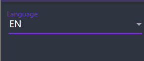

# BookStore Application User Guide

## Overview
BookStore is a desktop application for managing and reading books, with different features based on user roles.

## Installation

1. Download the latest release from the repository
2. Extract all files to your preferred location
3. Run `BookStoreApp.exe` to start the application

## User Roles

### Guest (Not Logged In)
- Login to existing account
- Register new account

### User
- Browse available books in the Book List
- Read owned books
- Submit book requests
- Manage account settings
- Change application language

### Manager
- Manage authors
- Manage genres
- Manage books
- View and process book orders
- View book requests
- Manage account settings

### Admin
- Access system dashboard (User management)
- Manage account settings

## Feature Guide

### Authentication
- Use the login screen to enter credentials

- New users can register via the Registration page

- Logout via the navigation menu

### Book List (User)
- View all available books for purchase
- Filter and search for books
- Purchase books to add to your collection

### Owned Books (User)
- View books you've purchased
- Open a book to view details or read content
- Books display cover, author, genres, and description

### Reading Books (User)
1. Select a book from your owned books

2. Click "Read" to flip to the reading view
3. Scroll through the book content

4. Click "Back" to return to book details

### Book Requests (User)
1. Navigate to "Add Book Request"
2. Fill in book details (title, author, publication year)
3. Submit the request
4. A confirmation toast will appear when submitted

### Managing Authors/Genres/Books (Manager)
- Add, edit, or remove authors

- Create and manage book genres

- Add new books with details and content

### Book Orders (Manager)
- View all book orders sorted by date
- Filter orders by status (pending, completed, etc.)
- View order details including user information and book details
- Mark orders as completed or pending

### Book Requests (Manager)
- View all book requests sorted by date

### User Management (Admin)
- View all users in the system
- Edit user details
- Delete users if necessary
- Create new users

### Settings (User/Manager/Admin)
- Change application theme (dark/light) and primary color

### Language Support (User/Manager/Admin)
- Available languages can be changed from the dropdown in the top right
- The app will immediately update all text to the selected language

## Troubleshooting
- If you encounter database errors, ensure the application has the necessary permissions
- For visual issues, try restarting the application
